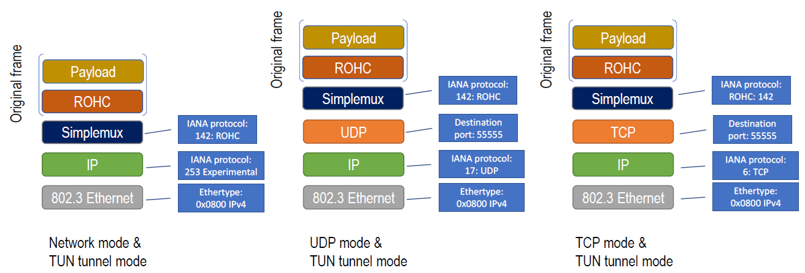

# Simplemux

[[_TOC_]]

## Introduction

There are some situations in which multiplexing a number of small packets into a bigger one is desirable. For example, a number of small packets can be sent together between a pair of machines if they share a common network path. Thus, the traffic profile can be shifted from small to larger packets, reducing the network overhead and the number of packets per second to be managed by intermediate routers.


In other cases it is necessary to send tunneled packets or frames between different network locations.

Multiplexing can be combined with Tunneling and Header Compression for the optimization of small-packet flows. This is called TCM. Different algorithms for header compression, multiplexing and tunneling can be combined in a similar way to [RFC 4170](http://tools.ietf.org/html/rfc4170).

Simplemux is a protocol able to encapsulate a number of packets belonging to different protocols into a single packet. It includes the "Protocol" field on each multiplexing header, thus allowing the inclusion of a number of packets belonging to different protocols on a packet of another protocol.

```

         +--------------------------------+
         |       Multiplexed Packet       |     Multiplexed protocol
         +--------------------------------+
         |      Multiplexing header       |     Multiplexing protocol (Simplemux)
         +--------------------------------+
         |       Tunneling header         |     Tunneling protocol
         +--------------------------------+
```

This is the structure of a packet including three multilplexed packets:

```
+-----------------+---------+----------------+---------+----------------+---------+----------------+
|Tunneling header |simplemux| muxed packet 1 |simplemux| muxed packet 2 |simplemux| muxed packet 3 |
+-----------------+---------+----------------+---------+----------------+---------+----------------+
```


The size of the simplemux separators is kept very low (it may be a single byte when multiplexing small packets) in order to reduce the overhead.

The savings can be significant. The next figure represents the significant bandwidth savings and packet-per-second reductions for small-packet flows (e.g. VoIP, FPS online games):


## About this repository

This repository includes a Linux user-space implementation of Simplemux, written in C. It uses Simplemux as the multiplexing protocol, and different options for the multiplexed and tunneling protocols:
- Multiplexed protocol: Ethernet, IP, RoHC ([RFC 5795](https://datatracker.ietf.org/doc/html/rfc5795)).
- Multiplexing protocol: Simplemux. It includes a _Protocol_ field.
- Tunneling protocol: IP, TCP/IP or UDP/IP.


### Folders

You will find the next folders:
- `src`. It includes the `.c` and `.h` files.
- `lua`. LUA scripts that can be added to Wireshark as plug-ins, which enable the dissection of Simplemux.
- `perl`. Perl scripts for extracting information from the log files.
- `documentation`.
- `simplemux_captures`. `.pcap` files captured with Wireshark.
- `rohc_library`. A copy of Didier Balvraux's RoHC library, version 1.7.0.


## Modes, flavors and multiplexing policies

### Tunnel modes

Simplemux has two *tunnel modes*, so it can include the next multiplexed protocols:

- **Tun mode**: it aggregates IP or RoHC ([RFC 5795](https://datatracker.ietf.org/doc/html/rfc5795)) packets. RoCH feedback messages are always sent in UDP/IP packets.
- **Tap mode**: it aggregates Ethernet frames.


### Modes

It includes the next options for the *tunneling* protocol, which correspond to four *modes*:

- **Network mode**: the multiplexed packet is sent in an **IP datagram** using Protocol Number `253` or `254` (according to [IANA](https://www.iana.org/assignments/protocol-numbers/protocol-numbers.xhtml), these numbers can be used for experimentation and testing ). For **Blast** flavor, Protocol Number `252` is used.
- **UDP mode**: the multiplexed packet is sent in an **UDP/IP** datagram. In this case, the protocol number in the outer IP header is that of UDP (`17`) and both ends must agree on a UDP port (the implementation uses `55555` or `55557` by default).
- **TCP server mode**: the multiplexed packet is sent in a **TCP/IP** datagram. In this case, the protocol number in the outer IP header is that of TCP (`4`) and both ends must agree on a TCP port (the implementation uses `55555` or `55557` by default).
- **TCP client mode**: as it happens in TCP server mode, **TCP/IP** datagrams are sent.


RoHC feedback information (when using RoHC Bidirectional mode) is sent in UDP packets using port `55556` by default.

### Flavors

Simplemux has the next *flavors*:

- [**Normal**](/documentation/normal_flavor.md): it tries to compress the separators as much as possible. For that aim, some single-bit fields are used.
- [**Fast**](/documentation/fast_flavor.md): it sacrifices some compression on behalf or speed. In this case, all the separators are 3-byte long, and all have the same structure.
In TCP *mode*, the use of Simplemux *fast* is compulsory.
- [**Blast**](/documentation/blast_flavor.md): it sends the same packet a number of times. But it only delivers one copy to the end point (the one that arrives first). It does not multiplex a number of packets together. It does NOT work in TCP mode.


### Multiplexing policies

Different [multiplexing policies](/documentation/multiplexing_policies.md) can be employed, depending on the flavor, i.e. four different conditions can be used and combined for triggering the sending of a multiplexed packet:

- Number of packets/frames: A number of packets/frames is defined. For example, if N=3, the optimizer will send one packet every three input packets/frames.
- Size: A maximum size is defined. When it is reached, the sending is triggered.
- Timeout: A time is defined. If it has expired when a packet/frame arrives, the sending is triggered.
- Period: A period is defined. At the end of the period, all the stored packets are sent.


### Protocol stack

The next images represent different options for the protocol stack.

#### A UDP/IP/Ethernet frame in TAP tunnel mode: IP, UDP and TCP modes


#### A UDP/IP packet in TUN tunnel mode: IP, UDP and TCP modes


#### A RoHC compressed packet in TUN tunnel mode: IP, UDP and TCP modes



### Summary

Simplemux has 3 _flavors_ (_Normal_, _Fast_ and _Blast_), 2 _tunnel modes_ (_Tun_ and _Tap_), 3 _modes_ (_Network_, _UDP_ and _TCP)_, and it can be used with or without RoHC compression. Therefore, it has 3x2x3x2 (36) options, in addition to the 4 multiplexing policies. However, not all the combinations have been implemented or do make sense.

The next table details the options that are available:
```
             +-----------------------+-------+-------------------------------+
             |         Mode          |       |                               |
             +-------+-------+-------+ RoHC  |     Multiplexing policies     |
             |Network|  UDP  |  TCP  |       |                               |
+--------+---+-------+-------+-------+-------+-------------------------------+
|        |tun|   X   |   X   |       |   X   |                               |
| Normal +---+-------+-------+-------+-------+ number, size, timeout, period |
|        |tap|   X   |   X   |       |       |                               |
+--------+---+-------+-------+-------+-------+-------------------------------+
|        |tun|   X   |   X   |   X   |   X   |                               |
| Fast   +---+-------+-------+-------+-------+ number, size, timeout, period |
|        |tap|   X   |   X   |   X   |       |                               |
+--------+---+-------+-------+-------+-------+-------------------------------+
|        |tun|   X   |   X   |       |       |                               |
| Blast  +---+-------+-------+-------+-------+        Always 1 packet *      |
|        |tap|   X   |   X   |       |       |                               |
+--------+---+-------+-------+-------+-------+-------------------------------+
```

* In _blast_ flavor, the packet is sent immediately. The period defines the interval used to send copies of the packet.


## Limitations of this implementation

- In _network_ flavor, only 20-byte IP headers are supported.
- IPv6 is not supported.


## Specifications (IETF drafts)

The specification of Simplemux can be found here: http://datatracker.ietf.org/doc/draft-saldana-tsvwg-simplemux/. It was not adopted by the IETF, although some discussion took place. It specifies the *Fast* and the *Normal* flavors (called *Compressed flavor* in the IETF draft).

The specification of Simplemux *Blast flavor* can be found here: https://datatracker.ietf.org/doc/draft-saldana-tsvwg-simplemux-blast/. It has never been discussed nor adopted by the IETF.


## Logs and statistics

The tool [generates logs](/documentation/logs.md), and some [Perl scripts](/perl) have been built to get statistics and real-time information.


## Research papers

A research paper about Simplemux *Normal flavor* can be found here:

**Jose Saldana**, Ignacio Forcen, Julian Fernández-Navajas, Jose Ruiz-Mas, "[_Improving Network Efficiency with Simplemux_](http://ieeexplore.ieee.org/xpl/articleDetails.jsp?arnumber=7363105)," [IEEE CIT 2015](http://cse.stfx.ca/~cit2015/), International Conference on Computer and Information Technology, pp. 446-453, 26-28 October 2015, Liverpool, UK. [Presentation](http://es.slideshare.net/josemariasaldana/improving-network-efficiency-with-simplemux). [Open dataset in Zenodo](http://dx.doi.org/10.5281/zenodo.35246). doi: [10.1109/CIT/IUCC/DASC/PICOM.2015.64](http://dx.doi.org/10.1109/CIT/IUCC/DASC/PICOM.2015.64). [**Author's PDF version in Researchgate**](https://www.researchgate.net/publication/304674195_Improving_Network_Efficiency_with_Simplemux).


A research paper using Simplemux *Blast flavor* can be found here:

**Jose Saldana**, Aníbal Antonio Prada Hurtado, Eduardo Martinez Carrasco, Yasmina Galve, Jesús Torres, "[_Fast and Reliable Sending of Generic Object Oriented Substation Event Frames between Remote Locations over Loss-Prone Networks_](https://www.mdpi.com/1424-8220/23/21/8879)," in [Sensors](https://www.mdpi.com/journal/sensors) 2023, 23(21), 8879. doi: [10.3390/s23218879](https://doi.org/10.3390/s23218879), [**Open Access**](https://www.mdpi.com/1424-8220/23/21/8879/pdf).


A presentation about Simplemux can be found here: http://es.slideshare.net/josemariasaldana/simplemux-traffic-optimization.


## How to compile

[How to compile Simplemux and (maybe) install RoHC](/documentation/how_to_install_and_compile.md).


## Example scenarios

Some [example scenarios](/documentation/scenarios.md) have been described in detail.


## Usage and examples

```
$ ./simplemux
Usage:
./simplemux -i <ifacename> -e <ifacename> -c <peerIP> -M <'network' or 'udp' or 'tcpclient' or 'tcpserver'> [-T 'tun' or 'tap'] [-p <port>] [-d <debug_level>] [-r <ROHC_option>] [-n <num_mux_tun>] [-m <MTU>] [-B <num_bytes_threshold>] [-t <timeout (microsec)>] [-P <period (microsec)>] [-l <log file name>] [-L] [-f] [-b]

./simplemux -h

-i <ifacename>: Name of tun/tap interface to be used for capturing native packets (mandatory)
-e <ifacename>: Name of local interface which IP will be used for reception of muxed packets, i.e., the tunnel local end (mandatory)
-c <peerIP>: specify peer destination IP address, i.e. the tunnel remote end (mandatory)
-M <mode>: 'network' or 'udp' or 'tcpclient' or 'tcpserver' mode (mandatory)
-T <tunnel mode>: 'tun' (default) or 'tap' mode
-f: fast flavor (compression rate is lower, but it is faster). Compulsory for TCP mode
-b: blast flavor (packets are sent until an application-level ACK is received from the other side). A period (-P) is needed in this case
-p <port>: port to listen on, and to connect to (default 55555)
-d <debug_level>: Debug level. 0:no debug; 1:minimum debug; 2:medium debug; 3:maximum debug (incl. ROHC)
-r <ROHC_option>: 0:no ROHC; 1:Unidirectional; 2: Bidirectional Optimistic; 3: Bidirectional Reliable (not available yet)
-n <num_mux_tun>: number of packets received, to be sent to the network at the same time, default 1, max 100
-m <MTU>: Maximum Transmission Unit of the network path (by default the one of the local interface is taken)
-B <num_bytes_threshold>: size threshold (bytes) to trigger the departure of packets (default MTU-28 in transport mode and MTU-20 in network mode)
-t <timeout (microsec)>: timeout (in usec) to trigger the departure of packets
-P <period (microsec)>: period (in usec) to trigger the departure of packets. If ( timeout < period ) then the timeout has no effect
-l <log file name>: log file name. Use 'stdout' if you want the log data in standard output
-L: use default log file name (day and hour Y-m-d_H.M.S)
-h: prints this help text
```


Some examples of the command to run Simplemux:

```
./simplemux -i tun0 -e wlan0 -M network -T tun -c 10.1.10.4
./simplemux -i tun1 -e wlan0 -M network -T tun -c 10.1.10.6
./simplemux -i tap3 -e eth1 -M udp -T tap -c 192.168.3.172 -d 2
./simplemux -i tap3 -e eth1 -M tcpserver -T tap -c 192.168.3.172 -d 3 -n 1 -f
./simplemux -i tap3 -e eth1 -M tcpclient -T tap -c 192.168.3.171 -d 2 -n 1 -f
```

## Test with [Valgrind](https://valgrind.org/)

[Test with Valgrind](/documentation/valgrind_test.md)


## Acknowledgements

This work has been partially financed by the **EU H2020 Wi-5 project** (G.A. no: 644262, see http://www.wi5.eu/ and https://github.com/Wi5), and the Spanish Ministry of Economy and Competitiveness project TIN2015-64770-R, in cooperation with the European Regional Development Fund.

The extensions added to Simplemux (*blast flavor*), as well as the `.lua` Wireshark dissector, have been done as a part of the **[H2020 FARCROSS project](https://cordis.europa.eu/project/id/864274)**, see [farcross.eu/](https://farcross.eu/). This project has received funding from the European Union’s Horizon 2020 research and innovation programme under grant agreement No 864274.

Jose Saldana (working at CIRCE Foundation), improved it in 2021-2022.

Jose Saldana (working at University of Zaragoza) wrote this program in 2015, published under GNU GENERAL PUBLIC LICENSE, Version 3, 29 June 2007 Copyright (C) 2007 Free Software Foundation, Inc.

Thanks to Davide Brini for his simpletun.c program. (2010) http://backreference.org/wp-content/uploads/2010/03/simpletun.tar.bz2

This program uses an implementation of RoHC by Didier Barvaux (https://rohc-lib.org/). More information about the [RoHC implementation used](/documentation/rohc.md)


## Disclaimer

This program has been written for research purposes, so if you find it useful, I would appreciate that you send a message sharing your experiences, and your improvement suggestions.

DISCLAIMER AND WARNING: this is all work in progress. The code may be ugly, the algorithms may be naive, error checking and input validation are very basic, and of course there can be bugs. If that's not enough, the program has not been thoroughly tested, so it might even fail at the few simple things it should be supposed to do right.

Needless to say, I take no responsibility whatsoever for what the program might do. The program has been written mostly for research purposes, and can be used in the hope that is useful, but everything is to be taken "as is" and without any kind of warranty, implicit or explicit. See the file LICENSE for further details.